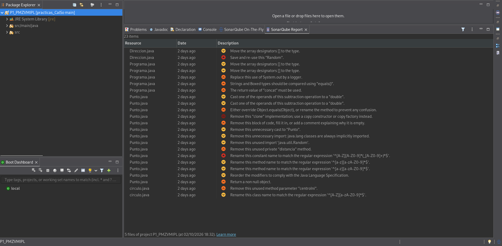

# Práctica 1 — Revisiones estáticas de código con SonarQube for Eclipse

## 1. Miembros del grupo

| Miembro | Nombre y apellidos |
|---|---|
| Alumna 1 | María Isabel Pérez Lisón |
| Alumna 2 | Paula Mei Zaragoza Villegas |

**Nombre del proyecto Eclipse:** `P1_PMZVMIPL`

---

## 2. Análisis inicial

Antes de realizar ninguna modificación sobre el código proporcionado se ha ejecutado el análisis estático del proyecto utilizando **SonarQube for Eclipse** con su configuración por defecto.

### Captura inicial



---

## 3. Disconformidades detectadas

En el análisis inicial se han identificado las siguientes disconformidades:

| Nº | Regla Sonar | Archivo | Línea | Disconformidad |
|---:|---|---|---:|---|
| 1 | `java:S2119` | `Direccion.java` | 21 | El objeto de tipo Random debe ser reusado |
| 2 | `java:S106` | `Programa.java` | 20 | La salida estándar no se debe usar para realizar logs |
| 3 | `java:S4973` | `Programa.java` | 23 | Los String deben compararse con la función equals() |
| 4 | `java:S108` | `Punto.java` | 148 | El código anidado por llaves no debe estar vacío |
| 5 | `java:S2225` | `Punto.java` | 151 | El método clone() no debe retornar null |

> Deben incluirse **todas las disconformidades observadas en el análisis inicial**.

---

## 4. Soluciones adoptadas

### Disconformidad 1 — `java:S2119`

**Localización:** `src/.../Direccion.java`, línea 21  
**Responsable:** Paula Mei Zaragoza Villegas
**Commit:** `fa52b73`

**Problema detectado**

El objeto de tipo Random no se reusa y puede llegar a ser ineficiente, puediendo provocar números no aleatorios.

**Solución adoptada**

Como solución se ha optado por mover la creación del Random() fuera de la función, y se ha declarado como una variable estática y final (variable global).

### Disconformidad 2 — `java:S106`

**Localización:** `src/.../Progama.java`, línea 20
**Responsable:** Paula Mei Zaragoza Villegas
**Commit:** `a5d2c6a`

**Problema detectado**

La salida estándar no se debe utilizar para tratar los logs. Se debe usar un logger dedicado ya que la salida estándar no es uniforme ni segura.

**Solución adoptada**

Para ello se hace uso del logger proporcionado por el propio Java.

### Disconformidad 3 — `java:S4973`

**Localización:** `src/.../Progama.java`, línea 23
**Responsable:** Paula Mei Zaragoza Villegas
**Commit:** `96c5d7d`

**Problema detectado**

Las cadenas de Java deben hacer uso de la función equals().

**Solución adoptada**

Se cambia el signo == por la función equals().

### Disconformidad 4 — `java:S108`

**Localización:** `src/.../Punto.java`, línea 148
**Responsable:** Paula Mei Zaragoza Villegas
**Commit:** `03316d3`

**Problema detectado**

El código anidado por llaves no debe estar vacío.

**Solución adoptada**

Para solucionarlo, se imprime mediante un Logger la captura de la excepcion.

### Disconformidad 5 — `java:S2225`

**Localización:** `src/.../Punto.java`, línea 151
**Responsable:** Paula Mei Zaragoza Villegas
**Commit:** `None`

**Problema detectado**

El método clone() no debe retornar null.

**Solución adoptada**

Para solucionarlo, se lanza un un IllegalStateException desde el catch, que evita seguir ejecutando código y nos permite eliminar el return null.

---

## 5. Resumen de las correcciones

| Nº | Regla Sonar | Responsable | Commit | Resultado |
|---:|---|---|---|---|
| 1 | `java:S2119` | Paula Mei Zaragoza Villegas | `fa52b73` | Resuelta |
| 2 | `java:S106` | Paula Mei Zaragoza Villegas | `a5d2c6a` | Resuelta |
| 3 | `java:S4973` | Paula Mei Zaragoza Villegas | `96c5d7d` | Resuelta |
| 4 | `java:S108` | Paula Mei Zaragoza Villegas | `03316d3` | Resuelta |
| 5 | `java:S2225` | Paula Mei Zaragoza Villegas | `None` | Resuelta |

---

## 6. Análisis final

Una vez realizadas todas las modificaciones se ha vuelto a ejecutar el análisis del proyecto completo con **SonarQube for Eclipse**.

### Captura final


La captura final permite comprobar que se está analizando el mismo proyecto utilizado en la captura inicial y que ya no quedan disconformidades pendientes.

---

## 7. Proyecto final

La versión final del proyecto Eclipse se encuentra en:

```text
P1/proyecto/P1_PMZVMIPL/
```

El proyecto incluido en esta carpeta contiene las modificaciones correspondientes a las soluciones documentadas anteriormente y coincide con la versión sobre la que se ha realizado la captura final.

---

## 8. Comprobación de la entrega

- [X] El nombre del proyecto sigue el formato establecido: `P1_INICIALES`.
- [X] Se identifican los dos miembros del grupo.
- [X] Se incluye la captura del análisis inicial.
- [ ] Se han documentado todas las disconformidades inicialmente detectadas.
- [ ] Cada solución está asociada a un commit identificable en `main`.
- [ ] Se identifica qué miembro del grupo realizó cada corrección.
- [ ] Los dos miembros han participado mediante commits propios.
- [ ] Se incluye la captura del análisis final.
- [ ] La captura final permite comprobar que no quedan disconformidades.
- [X] Se ha incorporado el proyecto Eclipse final dentro de `P1/proyecto/`.
- [ ] El proyecto final corresponde al código analizado en la captura final.